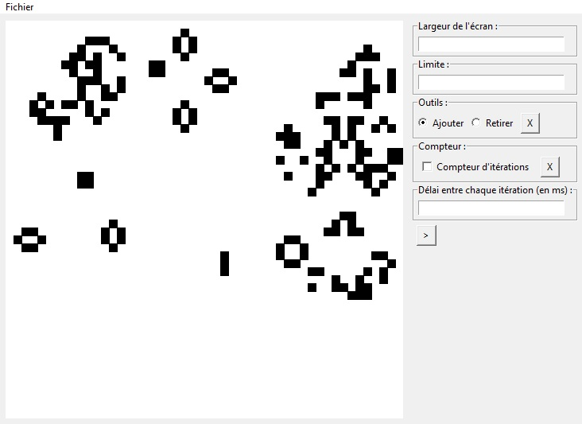

# Python-Tkinter-Game-Of-Life

This is the Conway Game of Life.
## Features
- Possibility to change the grid size
- Possibility to pause the simulation
- Possibility to save and load simulations
## Installation
1. Download the repository by clicking on `Code > Download ZIP`
2. Extract the ZIP file
3. Run `main.pyw`
## Requirements
- Python 3.7
- Python tkinter library
- Python math library